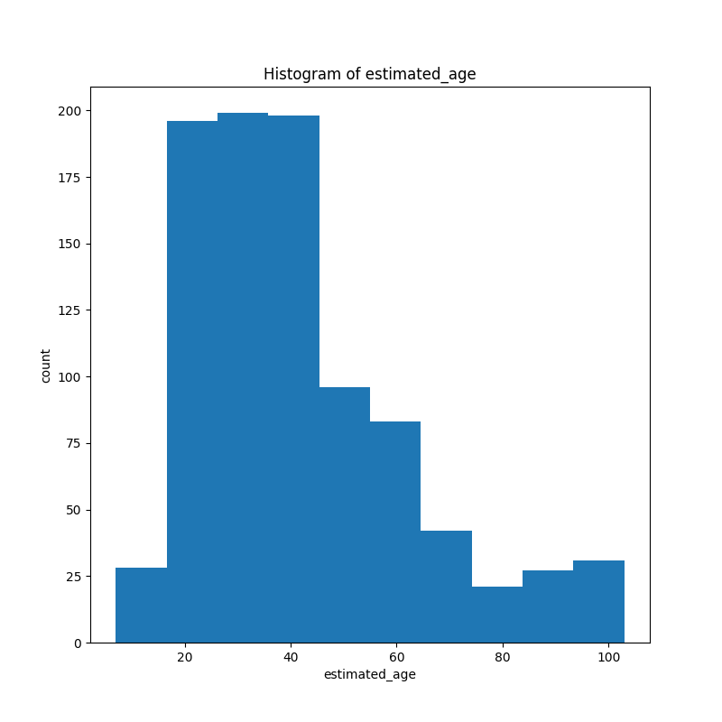
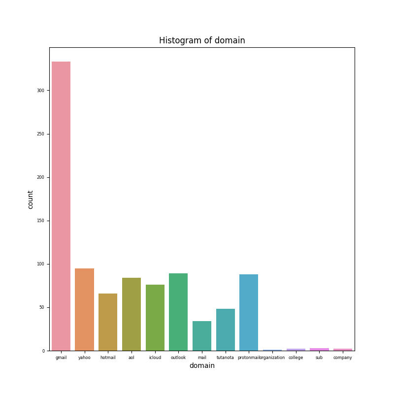
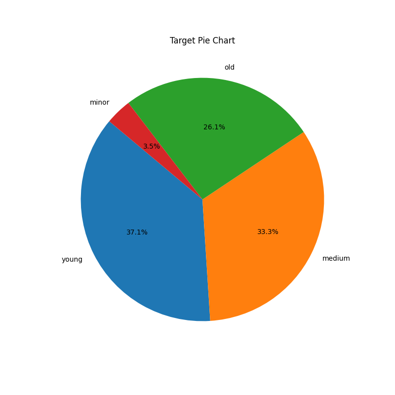
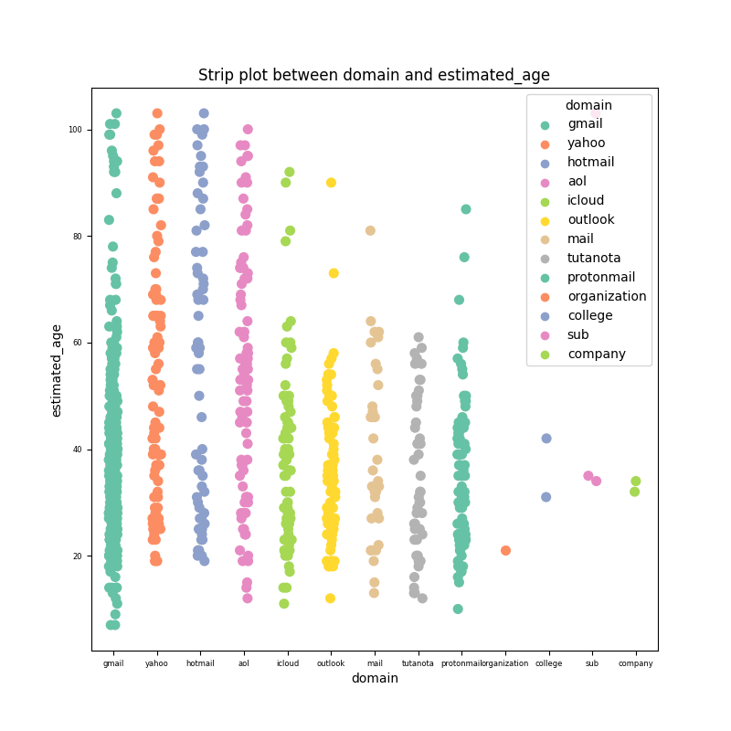
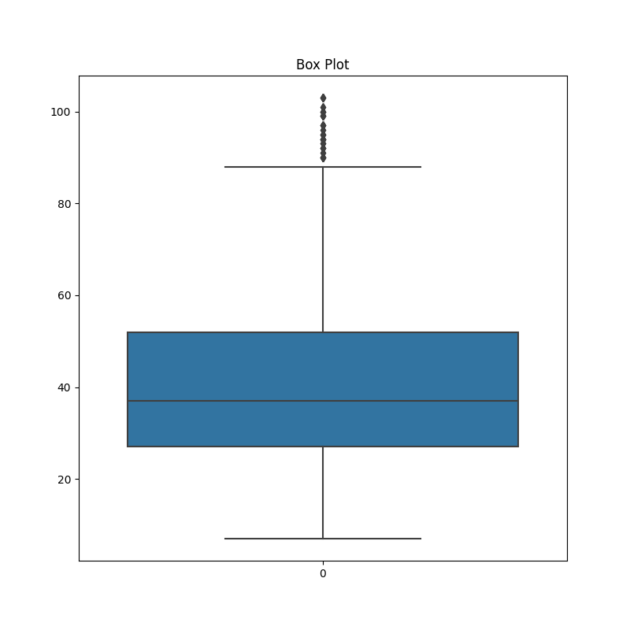

# Uptain Data Science Coding Challenge

Welcome to the Data Science Coding Challenge! This repository contains my work on predicting age group based on given email address

## Table of Contents
- [Introduction](#introduction)
- [Project Overview](#project-overview)
- [Dataset](#dataset)
- [Methodology](#methodology)
- [Results](#results)
- [Future Work](#future-work)
- [Installation](#installation)
- [Usage](#usage)
- [Contact](#contact)
- [License](#license)


## Introduction
This project demonstrates my ability to handle a full machine learning workflow, from data exploration and preprocessing to model selection and evaluation. It aims to predict the age group of a person (minor, young, medium or old) based on her/his email address.

## Project Overview
- **Objective**: Each email has a possible association with an age based on different attributes. The task is to find these attributes in the emails and build a model that can predict the age of a person based on their email address.
- **Techniques Used**: Data cleaning, exploratory data analysis, feature engineering, model training and evaluation, hyperparameter tuning.
- **Libraries Used**: Pandas, NumPy, Scikit-Learn, Matplotlib, Seaborn, XGBoost, LightGBM.

## Dataset
The dataset used in this project is a text file which has an unsorted list of emails. The file can be found in data directory [emails.txt](data/emails.txt), 
There are a total of 1073 emails in the text file provided.

## Methodology

1. **Data Cleaning**:
   - **Removed duplicated emails** [There are 83 duplicates in the provided text file]
   - **Removed invalid email addresses** [There are 69 invalid email addresses, As a future work these could be corrected, make them valid and add back to data frame. For the time being these invalid email addresses are removed]
   
2. **Feature Engineering**:
   - **Created the following new features from attributes in the email addresses:**
      - `username_len` : The length of username
      - `estimated_age` : Extracted the numbers from the email address and estimated birth year based on the following assumptions. 
         If there are no numbers in the email, age is estimated based on the domains. Certain domains are assumed to be used by particular age groups. If the domains are 'aol', 'hotmail' or 'yahoo', I assumed them as old generation(51+) or if domain is either of 'protonmail', 'outlook' and 'gmail', I assumed young or medium category and hence randomly choose an age in [18-50]. For all other domains, assumed to be younger generation. 
         If there are numbers in the email, first I estimated birth year and estimated age is calculated as difference between current year and estimated birth year.
         For the estimation of birth year, the following assumptions are made. If the extracted number is 4 digit, first I checked if it is less than current year. If it is less than current year, if 2 most significant digits are less than 19, then if last 2 digits are greater than 20, then estimated birth year will be ['19' + 'last 2 digits'] or else ['20' + 'last 2 digits']
         If extracted 4 digits are greater than current year or extracted digits are of length 3, we extract last 2 digits from it and check if it is greater than or equal to 20, then estimated birt year is ['19' + 'last 2 digits'] or else ['20' + 'last 2 digits'].
         If extracted digits are of length 2, if number is greater than 6 and less than or equal to 59, we assume that as the age of the person or if it is between 0 and 6, estimated birt year is considered as ['20' + 'extracted number'], else if number is between 60 and 99, then estimated birth year = ['19' + 'extracted number']
         If extracted digits are of length 1 or any of the above conditions are met, then we assume it as young generation and estimated age is a random number in [18-30]
         The estimated age is calculated from difference of current year and estimated birth year.
      - `domain` : Extracted domain from email addresses.  
     
      - **'username_len' feature found to be redundant and did not help machine learning models in prediction and hence not used in further analysis and model building**
   - `**Target variable to predict**
     - age_range` : Labeled data to one of the four classes ['minor', 'young', 'medium', 'old'], where 'minor' assumed to be of age range [0,17], 'young' :[18-30], 'medium' [31-50] and 'old' 51+. I have labeled the data according to these assumptions.
  

3. **Exploratory Data Analysis**:
   
   - Visualization of histograms of input features : estimated_age and domain
    
    
   
   - Visualization of target pie chart
      
   
   - Strip plot between estimated age and domain
     
   
   - Statistical analysis of feature 'estimated age' are as follows:
     mean : 41.25, std : 20.36, min : 20.36, Q1 : 26.00, Q3 :   52.00 , max : 103.00

      - Box plot
        In the box plot we can see few outliers, upper bound found by using IQR method is 88.5. The values about upper bound can be considered as outliers.
      
     
   
4. **Data Preprocessing**:
    - Encoding categorical variable, 'domain' using ONE HOT ENCODER
    - Normalizing/Scaling numerical feature, 'estimated_age' using standard_scaler()


5. **Model Building and Evaluation**:
    - After data preprocessing, we split the data into features(X : ['estimated_age' and one-hot-encoded 'domain']) and target (y). Then dataset is divided into training and test sets. Machine learning model is then trained on the training set. The trained model then makes predictions on the test set. 
    - The following machine learning models were trained : Random Forest, LGBM classifier, XGBoost classifier, KNN, Logistic Regression, Support Vector Machine.
      10 Fold stratified cross validation were performed and the hyperparameter tuning using the GridSearch was performed on the first fold and trained model were dumped using pickle. Model performance of each of classifier is assessed using Accuracy, AUC, Precision and Recall for each of the folds. Mean and Standard deviation of each metrics accross 10 folds were found.   

## Results
**10-Fold Cross Validation results**

| Model        | Accuracy     | AUC          | Precision    | Recall       |
|--------------|--------------|--------------|--------------|--------------|
| Random Forest | 0.90 &plusmn; 0.04 | 0.98 &plusmn; 0.01 | 0.93 &plusmn; 0.02 | 0.87 &plusmn; 0.07 |
| LGBM Classifier| 0.90 &plusmn; 0.03 | 0.98 &plusmn; 0.01 | 0.92 &plusmn; 0.05 | 0.91 &plusmn; 0.06|
| XGBoost Classifier | 0.91 &plusmn; 0.03 | 0.98 &plusmn; 0.01 | 0.94 &plusmn; 0.02| 0.94 &plusmn; 0.02 |
| KNN | 0.89 &plusmn; 0.04 |  0.94 &plusmn; 0.03 | 0.92 &plusmn; 0.03 | 0.87  &plusmn; 0.08 |
| Logistic Regression | 0.89 &plusmn; 0.03 | 0.96 &plusmn; 0.01 | 0.92 &plusmn; 0.02 | 0.91  &plusmn; 0.04 |
| Support Vector Machine | 0.73 &plusmn; 0.06 | 0.87 &plusmn; 0.05 | 0.81 &plusmn; 0.05 | 0.77  &plusmn; 0.06 |


## Computation time and Memory Usuage
The total computation time and memory used for the hyper parameter tuning, training and 10-fold cross validation is as shown in the bellow table:


| Model               | Time(sec)   | Memory(MB)   |
|---------------------|-------------|--------------|
| Random Forest       | 8.13 | 2.05 |
| LGBM                | 34.06 | 1.35|
| XGBoost             | 8.79 | 11.60 |
| KNN                 | 0.63 | 0.79 |
| Logistic Regression | 21.74 | 0.17 |
| SVM                 | 2.05 | 0.70 |


## Key insights:
- We have very good results with RandomForest, LGBM, XGBOOST, KNN and Logistic Regression
- LGBM and Logistic regression need more computation time for hyperparameter tuning and training
- Memory usuage of XGBoost is the highest

## Future Work
- **Feature Engineering**: Experiment with any other additional attributes and capture more complex relationships.
- **Model Improvement**: Experiment with additional algorithms like clustering unsupervised learning, so that we work on unlabeled data


## Installation
To get started with this project, follow these steps:

1. **Clone the repository:**
    ```sh
    git clone https://github.com/sabithamanoj/data-science-coding-challenge-sabitha.git
    cd data-science-coding-challenge-sabitha
    ```

2. **Create a virtual environment:**
    ```sh
    python3.10 -m venv venv
    source venv/bin/activate  # On Windows use `venv\Scripts\activate`
    ```

3. **Install the required libraries:**
    ```sh
    pip install -r requirements.txt
    ```
## Usage
- **Data Analysis**
  - To run data analysis script: (All the analysis plots can be found in **plots** directory.)
       ```sh
      python ./src/data_analysis.py -i data/emails.txt
      ```
  
- **Model training and saving trained models**
    - To run training script: (The information such as tuned hyperparameters from GridSearch, 10-fold cross-validation metrics can be found in **training.log** in **log_files** directory)
         ```sh
        python ./src/training.py -i data/emails.txt
         ```
- **Run the trained models on terminal**
   - It is possible to just run the ML models already dumped in pickle format from the terminal and to predict age. Results is saved as **output.json** in **output** directory. To load random forest model, run the following:
     ```sh
     python ./src/load_and_test_model.py -e sabi.manoj80@gmail.com -m models/random_forest_model.pkl -i saved_metadata/metadata.pkl -o saved_metadata/encoder.pkl -s saved_metadata/scaler.pkl
       ```
     ```sh
     options to be provided to script:
     
     -e 'email address that need be provided'
     
     -m 'Trained ML model that was dumped during the training process'
     
     -i 'Metadata information pickle file dumped during training - It contains information such as feature names and class categories'
     
     -o 'One Hot Encodel pickle file dumped during training'
     
     -s 'Standard scaler pickle file dumped during training'
     ```
    
   - Similarly to run LGBM model:
     ```sh
     python ./src/load_and_test_model.py -e sabi.manoj80@gmail.com -m models/lgbm_classifier_model.pkl -i saved_metadata/metadata.pkl -o saved_metadata/encoder.pkl -s saved_metadata/scaler.pkl
  - To run XGBoost model:
     ```sh
     python ./src/load_and_test_model.py -e sabi.manoj80@gmail.com -m models/xgboost_classifier_model.pkl -i saved_metadata/metadata.pkl -o saved_metadata/encoder.pkl -s saved_metadata/scaler.pkl
    
  - To run KNN model:
     ```sh
     python ./src/load_and_test_model.py -e sabi.manoj80@gmail.com -m models/knn_model.pkl -i saved_metadata/metadata.pkl -o saved_metadata/encoder.pkl -s saved_metadata/scaler.pkl
  - To run Logistic regression model:
     ```sh
     python ./src/load_and_test_model.py -e sabi.manoj80@gmail.com -m models/logistic_regression_model.pkl -i saved_metadata/metadata.pkl -o saved_metadata/encoder.pkl -s saved_metadata/scaler.pkl

## Note :
Code developed and verified with **PyCharm2021.3.1** on **Windows11**

## Contact
If you have any questions please feel free to reach out:

- **Name**: Sabitha Manoj
- **Email**: [sabitha.manoj0891@googlemail.com](mailto:your-email@example.com)

# Disclaimer

This repository contains a list of generated test emails. Any real match with existing emails is purely coincidental and unintentional. All the emails here were generated for testing purposes only.

## License

This project is licensed under the MIT License - see the [LICENSE](LICENSE) file for details.